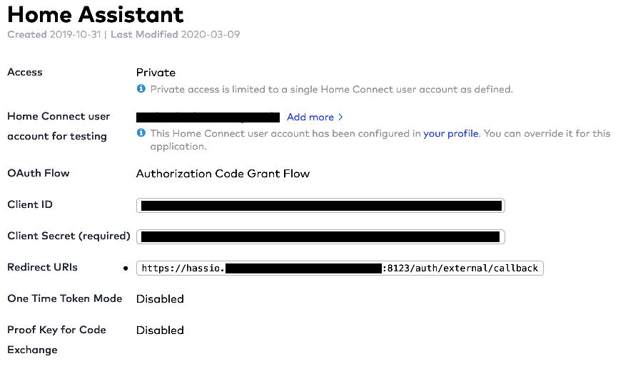
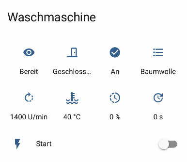

# Home Connect Neo integration for Home Assistant

The `home connect neo` integration is a component for Home Assistant to enable the control of home connect compatible appliances like washer, dryer, dishwasher etc. The usage requires a home connect developer account.
(This integration based on Home Connect module from: https://github.com/DavidMStraub/homeconnect and https://github.com/DavidMStraub/homeassistant-homeconnect)

## Preparation

- Create an account on https://developer.home-connect.com/
- Register a new application with OAuth Flow type Authorization Code Grant Flow and Redirect URI https://YOUR_HOMEASSISTANT_BASE_URL:PORT/auth/external/callback
- Keep your Client ID and Client Secret ready



## Installation

1. If you have not yet installed HACS, go get it at https://hacs.xyz/ and walk through the installation and configuration.

2. On the top right corner click on the three vertical dots and select user defined repositories. Enter https://github.com/FlavorFx/home_connect_neo and hit the add button. Then find the `home connect neo` integration and install it.

3. Restart Home Assistant!

4. Install the new integration through _Home Assistant -> Configuration -> Integrations_. click "+" and search for "Home Connect neo". Enter your Client ID and Client Secret. After this open the external Home Connect Web site, enter your login credentials and accept the terms and conditions. Than close the external web site and return to Home Assistant. Assign a room to the appliance.

## Lovelace card configuration

The card requires the following mods:

- https://github.com/ofekashery/vertical-stack-in-card
- https://github.com/thomasloven/lovelace-card-mod

These are obtainable via HACS.

ui-lovelace.yaml

```
type: 'custom:vertical-stack-in-card'
cards:
  - type: conditional
    conditions:
      - entity: binary_sensor.waschmaschine_power
        state: 'on'
    card:
      type: glance
      title: Waschmaschine
      entities:
        - entity: sensor.waschmaschine_operation_state
        - entity: binary_sensor.waschmaschine_door
        - entity: binary_sensor.waschmaschine_remote_control
        - entity: sensor.waschmaschine_program
        - entity: sensor.waschmaschine_spin_speed
        - entity: sensor.waschmaschine_temperature
        - entity: sensor.waschmaschine_progress
        - entity: sensor.waschmaschine_remaining_time
      columns: 4
      show_state: true
      show_name: false
      show_icon: true
      state_color: false
      card_mod:
        style: |
          ha-card { margin-top: -10px; }
  - type: conditional
    conditions:
      - entity: binary_sensor.waschmaschine_power
        state: 'on'
    card:
      type: entities
      entities:
        - entity: switch.waschmaschine_start
      state_color: false
      card_mod: null
      style: |
        ha-card { margin-top: -10px; }
```



## Supported devices

| Appliance       | Description       |
| --------------- | ----------------- |
| `Washer`        | supported         |
| `Dryer`         | supported |
| `Washer Dryer`   | rudimentary |
| `Refrigerator`  | rudimentary |
| `Wine Cooler`    | rudimentary |
| `Freezer`       | rudimentary |
| `Dishwasher`    | rudimentary |
| `Fridge Freezer` | rudimentary |
| `Oven`          | rudimentary |
| `Coffee Maker`   | rudimentary |
| `Hood`          | rudimentary |
| `Hob`           | rudimentary |
| `Warming Drawer` | not supported yet |
| `Cleaning Robot` | not supported yet |
| `Cook Processor` | not supported yet |

## Debugging

To enable debug logging for this integration and related libraries you
can control this in your Home Assistant `configuration.yaml`
file. Example:

```
logger:
  default: critical
  logs:
    homeconnect: debug
    custom_components.home_connect_neo: debug
```

After a restart detailed log entries will appear in `/config/home-assistant.log`.

## License
Home Connect Neo is released under the MIT License. See [MIT License](./LICENSE) for more information.
